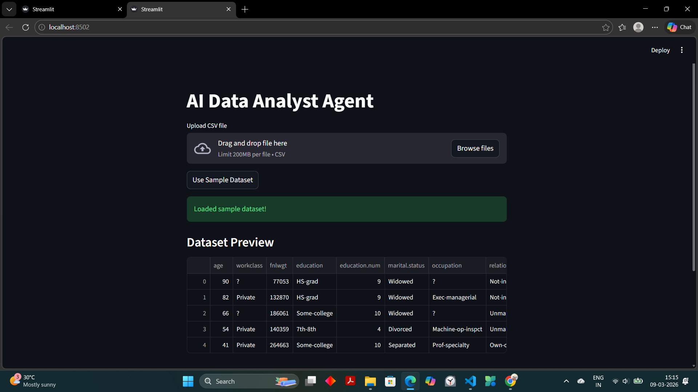
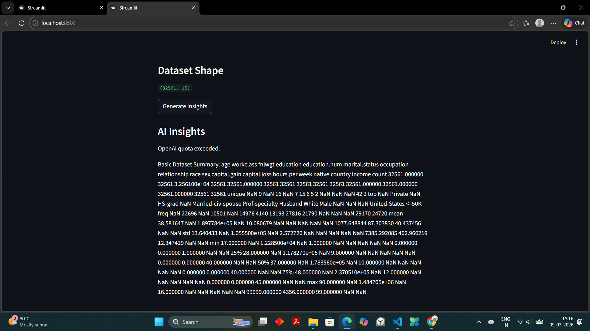
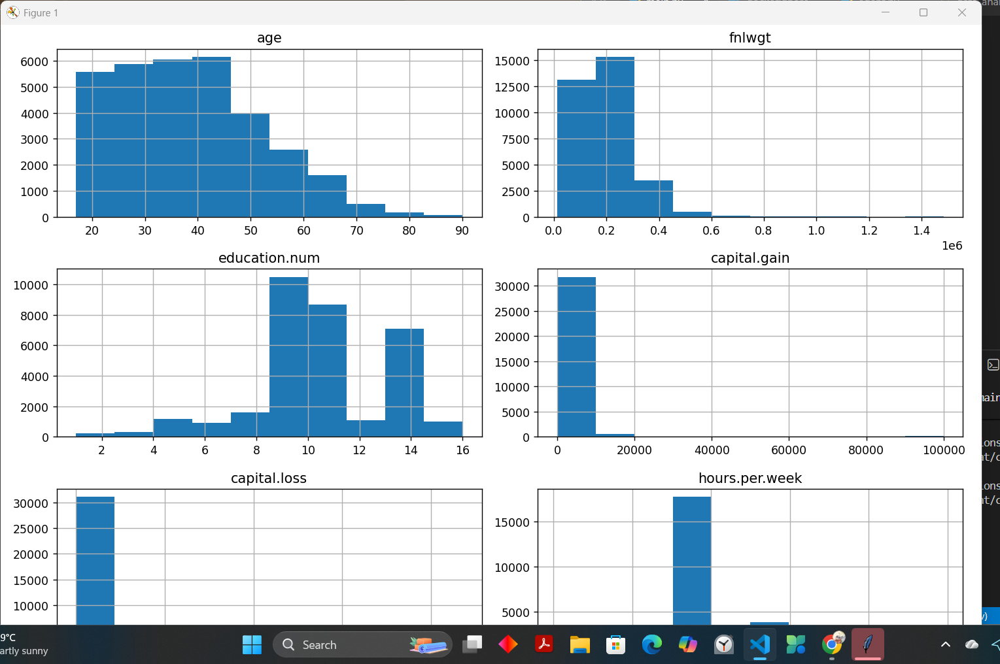
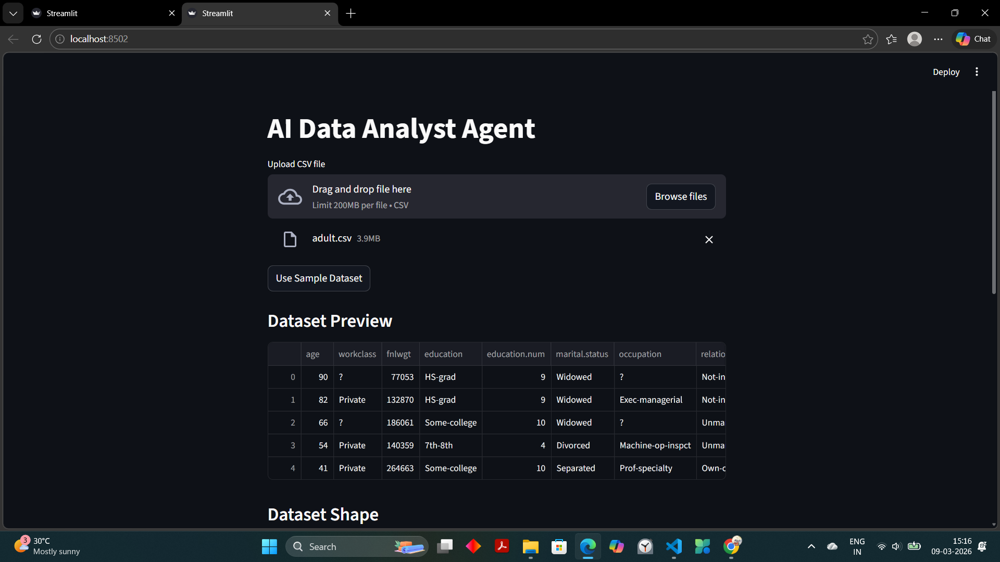

# AI Data Analyst Agent

An AI-powered data analysis dashboard that automatically performs exploratory data analysis (EDA), generates visualizations, and produces AI-driven insights from uploaded datasets.

The goal of this project is to simulate the workflow of a junior data analyst using AI automation.

## Project Overview

Data analysts spend significant time performing repetitive tasks such as:

- understanding dataset structure

- generating statistics

- building visualizations

- writing analytical insights

This project automates those tasks using a combination of data science tools and AI models.

Users simply upload a dataset and the system automatically:

1. analyzes the dataset

2. generates statistical summaries

3. creates visualizations

4. produces AI-generated insights

5. displays results in an interactive dashboard

## Key Features

- Upload CSV datasets

- Automated exploratory data analysis

- Interactive dashboard

- AI-generated insights

- Statistical summaries

- Data visualizations

- Modular and scalable architecture

## Tech Stack

Programming Language
- Python

Data Processing
- Pandas
- NumPy

Machine Learning
- Scikit-learn

Visualization
- Matplotlib
- Seaborn

Dashboard
- Streamlit

AI Integration
- OpenAI API

Containerization
- Docker

Development Environment
- Visual Studio Code

## System Architecture

User Upload Dataset
        │
        ▼
Data Processing (Pandas)
        │
        ▼
Exploratory Data Analysis
        │
        ▼
Visualization Engine
(Matplotlib / Seaborn)
        │
        ▼
AI Insight Generator
(OpenAI API)
        │
        ▼
Interactive Dashboard
(Streamlit)

## Project Structure

ai-data-analyst-agent
│
├── app
├── src
├── data
├── notebooks
├── images
├── requirements.txt
└── README.md

## Dashboard Preview

## AI Insights

## CLI Interface

## Upload Dataset Feature

## Example Workflow

Upload dataset
        │
        ▼
Automatic EDA
        │
        ▼
Generate visualizations
        │
        ▼
AI insight generation
        │
        ▼
Interactive dashboard output

## How to Run

1. Clone repository

git clone https://github.com/swati-mishra07/ai-data-analyst-agent

2. Install dependencies

pip install -r requirements.txt

3. Run Streamlit app

streamlit run app/streamlit_app.py

## Dataset Recommendation

You can test the system with datasets from:

- Kaggle

Recommended datasets:

-  sales datasets

- housing price datasets

- customer behavior datasets

- financial datasets

  
## Future Improvements

- Automated ML model selection
- Advanced visualizations
- Deployment to cloud
- Anomaly detection
- Real-time analytics
- Experiment tracking

## Author

Swati Mishra

- Github : https://github.com/swati-mishra07
- LinkedIn: https://www.linkedin.com/in/swati-mishra-801193308
